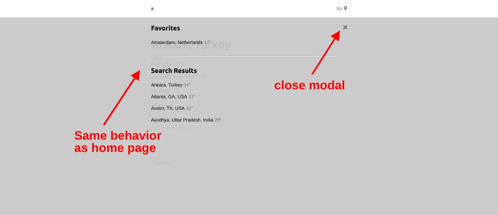

# Real time weather app

This app allows users to look up current weather information for cities around the world and add cities to a “favorites” list.

The search results display cities and their current temperatures, sorted alphabetically.

Clicking on a city from the list will navigate to a page with more information on that city.

Users can also click on the "my location" link to display information on their current location.

After initial loading, the app works offline with the latest data available from the previous session (Searching is disabled)

The app is fully responsive and supports mobiles, tablets and larger devices

---

## Pages

- [Home](#home-page)
- [City details](#city-details-page)
- [User location](#user-location-page)

### Home page

Shows the latest search results of cities. Users can search for cities in the top bar and see the results dynamically change as they type.

By default, the home page loads the 15 largest cities in the world by population.

Clicking on a city from the list navigates to the details page of that city.

Users can add cities to favorites and/or remove them from the display.

Users can remove cities from favorites.

### City details page

Shows more details about the selected city, and allows creating notes and storing notes on the user's device.

Notes can be edited and deleted as well.

Using the search bar in this page will open up a modal with the dynamic results. Pressing the Escape key twice or clicking the X button will close the modal. The modal behaves like the home page.

### User location page

Shows detailed information about the user's current location.

Users will be prompted to grant the app permission to detect their location.

Other than that the page is the same as the city details page, it allows comments and search in the top bar
